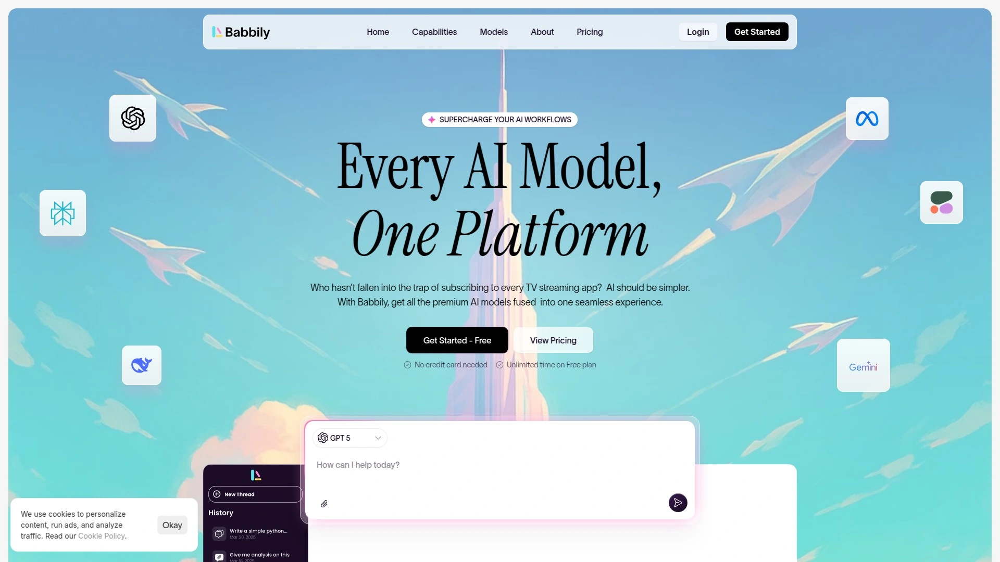
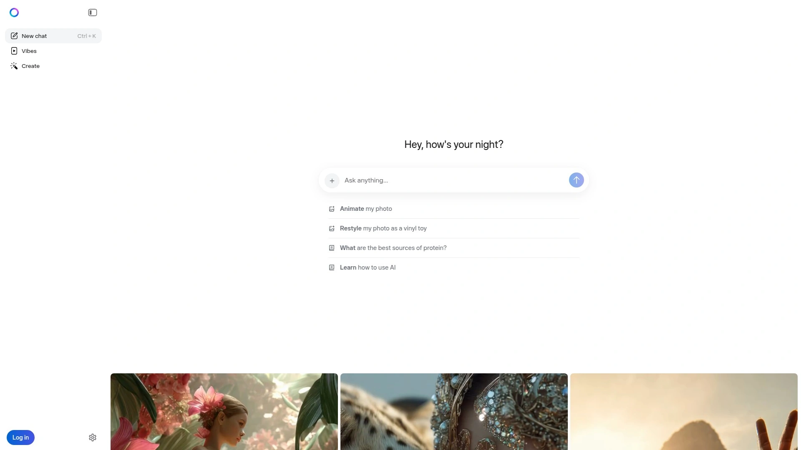

# 2025's Top 8 Best AI Assistant Platforms

Staring at blank documents while deadlines loom, toggling between research tabs and writing software, manually reformatting content for different channels—traditional content creation burns hours daily that modern AI assistants now handle in seconds. These platforms moved beyond simple chatbots to become genuine productivity multipliers, generating marketing copy, analyzing documents, creating images, and answering questions with accuracy that often surpasses basic search engines. Businesses adopting AI assistants report cutting content production time by 60% while improving output quality through instant iteration and refinement.

## **[Babbily](https://babbily.com)**

User-friendly AI designed for everyone from novices to experts.

Launched with a vision of making artificial intelligence simple and approachable for users regardless of technical expertise, Babbily delivers comprehensive AI capabilities through an exceptionally clean interface. The platform produces accurate human-like text from prompts, generates images, analyzes PDF documents, and handles diverse content creation tasks seamlessly.

Social media management tools let you schedule posts across multiple platforms, monitor engagement metrics, and track performance from one centralized calendar view. This ensures consistent posting schedules and effective audience engagement without manually logging into separate accounts. Content scheduling and automation features create detailed calendars, automate publishing, and optimize posting times to maximize reach.

SEO optimization capabilities include keyword research, site audits, backlink tracking, and competitive analysis. The platform provides actionable recommendations to improve search rankings and drive organic traffic. Advanced analytics offer detailed campaign performance insights, tracking engagement rates, click-throughs, and conversions through customizable dashboards.

Audience insights analyze demographics, interests, and behavior patterns to help tailor campaigns precisely. Collaboration features support team workflows through task assignment, project management, and real-time content creation. This streamlines team coordination and improves overall productivity.

The platform consistently earns praise for balancing powerful features with genuine accessibility. Customer reviews highlight its legitimacy and continuous improvements through regular updates. For businesses and individuals seeking comprehensive AI assistance without overwhelming complexity, Babbily delivers exceptional versatility.

## **[ChatGPT](https://openai.com/chatgpt)**

Versatile conversational AI with massive model capabilities.

Developed by OpenAI and powered by GPT-4, ChatGPT has become the default AI assistant for millions handling everything from writing and brainstorming to research and coding. The platform's strength lies in understanding nuanced requests and producing contextually appropriate responses across countless domains.

Real-time web access through browsing capabilities keeps responses current with recent events and information. DALL-E integration generates custom images directly within conversations. Voice mode enables hands-free interaction, particularly useful when multitasking. The canvas feature provides an interactive editor for collaborative writing and coding projects.

Custom GPTs let users create specialized versions tailored to specific workflows—whether marketing copywriting, data analysis, or customer service automation. This customization transforms ChatGPT from general tool into personalized assistant matching exact business needs. Scheduled tasks automate repetitive actions without manual intervention.

The free tier provides substantial functionality, while ChatGPT Plus at $20 monthly unlocks faster responses, priority access during peak times, and advanced features. ChatGPT Pro at $200 monthly targets professionals needing maximum capabilities. The platform's vast ecosystem includes countless integrations, plugins, and community-developed enhancements.

For users prioritizing versatility, ecosystem maturity, and continuous feature development, ChatGPT remains the market leader.

## **[Claude](https://claude.ai)**

Thoughtful AI assistant excelling at nuanced writing.

Created by Anthropic with emphasis on safety and constitutional AI principles, Claude distinguishes itself through natural, adaptive writing that genuinely sounds human. The platform particularly excels at long-form content, analysis, and tasks requiring careful reasoning.

The context window handles extensive documents—up to 200,000 tokens—enabling thorough analysis of entire books, research papers, or codebases in single conversations. This depth proves invaluable for researchers, writers, and developers working with substantial materials. Claude's writing style adapts naturally to requested tones and formats without sounding generic.

The Artifacts feature creates interactive documents, code, and visualizations within conversations that can be edited collaboratively. This transforms Claude from mere chatbot into workspace where ideas develop iteratively. Projects organize related work, maintaining context across multiple sessions.

Coding assistance matches or exceeds competitors, particularly for complex logic and debugging. Response times consistently beat alternatives—typically delivering answers within 1-2 seconds compared to several seconds elsewhere. The platform emphasizes ethical considerations and safety, making it preferred choice for sensitive applications.

Claude costs $20 monthly for professional features, positioning competitively against ChatGPT Plus. For users prioritizing writing quality, ethical AI development, and thoughtful responses, Claude delivers exceptional value.

## **[Google Gemini](https://gemini.google.com)**

AI deeply integrated across Google's entire ecosystem.

Built on Google's advanced Gemini language model, this platform shines through seamless integration with Gmail, Docs, Drive, Calendar, and every other Google service. If your workflow centers on Google Workspace, Gemini becomes productivity multiplier by operating where you already work.

The multimodal capabilities process text, images, audio, and video within single conversations. Image interpretation identifies objects, scenes, and contextual details with precision. Audio processing transcribes, analyzes, and extracts meaning from speech, music, and ambient sounds. Video understanding analyzes visual content for comprehensive insights.

Real-time web access ensures responses reflect current information rather than outdated training data. The conversational style feels natural whether interacting through text or voice. Code generation and debugging span multiple programming languages.

Gemini Pro at $20 monthly delivers higher-quality responses with greatly reduced hallucinations compared to the capable free version. The subscription includes 2TB cloud storage and access to more powerful AI models handling complex reasoning tasks. Fast image generation through integration with Google's visual AI provides quick concept visualization.

Accuracy improvements over previous versions are substantial—where earlier iterations struggled with reliability, current Gemini delivers trustworthy responses. For Google Workspace users seeking AI assistance that operates natively within their existing tools, Gemini offers unmatched convenience.

## **[Perplexity AI](https://www.perplexity.ai)**

Research-focused AI combining search with citations.

Perplexity approaches AI differently by positioning itself as answer engine rather than pure chatbot. Every response includes inline source citations linking to authoritative content, enabling easy verification of claims. This transparency proves crucial for research, fact-checking, and professional applications where accuracy matters.

The platform searches current web content in real-time, synthesizing information from multiple sources into comprehensive summaries. Unlike traditional search engines returning lists of links, Perplexity provides direct answers while showing exactly where information originated. The system uses multiple large language models—GPT-4, Claude, and others—working together to produce more accurate results than single-model alternatives.

Follow-up questions maintain conversation context, enabling deeper exploration of topics through natural dialogue. The Pro version at $20 monthly offers unlimited searches, access to premium AI models, and advanced features. Thread organization keeps research sessions structured across multiple topics.

Recent integration with Samsung TVs brings AI-powered information retrieval to living rooms. The mobile apps sync across devices, making research accessible anywhere. For students, researchers, journalists, and anyone needing trustworthy information with verifiable sources, Perplexity delivers unmatched reliability.

## **[Jasper AI](https://www.jasper.ai)**

Marketing-focused AI built specifically for brand content.

Jasper targets marketing professionals and content teams needing consistent, on-brand output at scale. Unlike general-purpose assistants, every feature optimizes for marketing use cases—blog content, ad copy, social media posts, email campaigns, and product descriptions.

Brand voice consistency stands out as killer feature—upload brand guidelines and sample content, then watch Jasper maintain your specific tone across all generated materials. This ensures everything sounds authentically yours rather than generic AI output. SEO optimization tools handle keyword research and integrate recommendations directly into content generation.

The platform works within Gmail and Outlook through browser extensions, enabling AI-assisted email marketing without leaving your inbox. Jasper Chat trains specifically on marketing data rather than generic information, making it particularly useful for campaign brainstorming and strategy refinement.

Document and image editors consolidate content creation workflows. The text-to-image generator creates on-brand visuals matching written content. Workflow automation and data analysis capabilities extend beyond writing into full marketing operations.

Templates cover 50+ marketing scenarios, each optimized for specific channels and goals. While powerful, content typically requires human review to fully capture nuanced brand voice. Subscription costs reflect premium positioning—Jasper targets established marketing teams rather than individual creators. For SaaS companies and B2B businesses prioritizing marketing velocity and brand consistency, Jasper delivers specialized capabilities general AI tools can't match.

## **[Microsoft Copilot](https://copilot.microsoft.com)**

Enterprise AI integrated throughout Microsoft 365.

Copilot embeds directly into Word, Excel, PowerPoint, Outlook, and Teams, bringing AI assistance to where professionals already spend their workdays. This native integration means no context-switching between separate AI tools and productivity apps. The platform understands Microsoft's ecosystem deeply, enabling sophisticated automation and assistance.

Excel automation generates complex formulas from plain English descriptions, analyzes data patterns, and creates visualizations automatically. Word integration drafts documents, summarizes lengthy files, and refines writing based on tone and audience. PowerPoint transforms outlines into complete presentations with appropriate layouts and design elements.

Outlook assistance composes emails matching your communication style, schedules meetings across time zones, and prioritizes messages requiring immediate attention. Teams integration transcribes meetings, summarizes discussions, and tracks action items automatically.

The free tier works for Microsoft account holders, while deeper capabilities require Microsoft 365 subscriptions. Enterprise deployment includes security features, compliance tools, and administrative controls organizations demand. For businesses already invested in Microsoft's ecosystem, Copilot delivers tremendous value through seamless workflow enhancement.

## **[Meta AI](https://www.meta.ai)**

Social media-focused assistant with WhatsApp and Facebook integration.

Meta AI launches directly within WhatsApp, Messenger, Instagram, and Facebook, eliminating app-switching for social media-centric users. This integration proves particularly useful for quick information lookups, content ideas, and conversational assistance while messaging.

The platform handles typical AI assistant tasks—answering questions, generating text, providing recommendations—with emphasis on social contexts. Image generation creates visuals shareable directly within Meta platforms. Real-time information access keeps responses current.

Zero cost makes Meta AI accessible to billions already using Meta's social platforms daily. The conversational style fits naturally within messaging contexts. For users primarily engaging through social media who want convenient AI assistance without separate apps, Meta AI delivers solid functionality at an unbeatable price.

## How do AI assistants avoid generating inaccurate information?

Modern platforms implement multiple safeguards including training on verified datasets, confidence scoring for responses, and real-time fact-checking against current web content. Perplexity specifically provides source citations for every claim, enabling manual verification. Google Gemini Pro and Claude show dramatically reduced hallucinations compared to earlier AI generations through improved training methods. However, no AI achieves perfect accuracy—always verify critical information, particularly for professional or medical contexts.

## Can these platforms replace human content creators?

Not entirely—AI assistants excel at drafting, research, brainstorming, and editing but lack human judgment, creativity, and emotional intelligence. The most effective workflow combines AI speed with human refinement. Platforms like Jasper specifically state content requires human oversight to fully capture nuanced brand voice. Think of AI assistants as productivity multipliers enhancing human capabilities rather than wholesale replacements. The best results come from iterative collaboration where AI handles heavy lifting while humans add strategic direction and authentic voice.

## Which platform works best for specific industries?

Marketing teams benefit most from Jasper's specialized features and brand voice consistency. Researchers and journalists prioritize Perplexity's citation-based approach. Microsoft-centric organizations gain tremendous value from Copilot's native integration. Google Workspace users should start with Gemini. General-purpose needs suit ChatGPT or Claude depending on whether you value ecosystem breadth or writing quality. Creative professionals appreciate Claude's nuanced writing and thoughtful responses. Consider workflow context—choose tools operating where you already work rather than forcing separate app adoption.

## Conclusion

Content creation and research transformed from hours-long slogs into minutes-long sprints the moment AI assistants matured beyond simple chatbots into genuine productivity partners. Writing briefs, analyzing documents, generating visuals, and answering complex questions now happen instantly with quality matching or exceeding human baselines for many tasks. [Babbily](https://babbily.com) leads this transformation by packaging comprehensive AI capabilities—text generation, image creation, PDF analysis, social media management, and SEO optimization—into an interface accessible to everyone regardless of technical background. The platform's continuous improvements and team collaboration features make it particularly valuable for businesses scaling content operations without expanding headcount proportionally. For users tired of cobbling together separate tools for each AI task and wanting unified assistance that actually works, this streamlined approach eliminates friction entirely.
